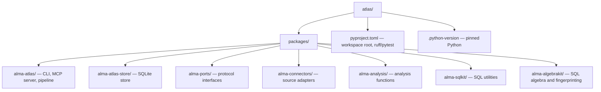

# Contributing to Alma Atlas

## Prerequisites

- Python 3.12+
- [uv](https://docs.astral.sh/uv/) — fast Python package manager

## Setup

```bash
# Clone the repo
git clone https://github.com/your-org/atlas.git
cd atlas

# Install all workspace packages in editable mode
uv sync --all-packages

# Verify the CLI works
uv run alma-atlas --help
```

## Project structure



## Development workflow

```bash
# Run linter
uv run ruff check .

# Run formatter
uv run ruff format .

# Type check
uv run ty check $(python3 scripts/typecheck_targets.py --shell)

# Run tests
uv run pytest

# Run a specific package's tests
uv run pytest packages/alma-atlas/
```

## Documentation

```bash
# Install the docs toolchain alongside the workspace packages
uv sync --all-packages --group docs

# Preview the docs site locally
uv run mkdocs serve

# Build docs with warnings treated as errors
uv run mkdocs build --strict
```

The GitHub Pages publish workflow expects the repository to already have Pages
enabled with **GitHub Actions** as the build source. For first-time bootstrap,
either enable that manually in repository settings or provide a
`PAGES_ENABLEMENT_TOKEN` repository secret so `actions/configure-pages` can
enable it automatically.

## Code style

- **Formatter**: ruff format (line length 120)
- **Linter**: ruff with rules E, F, I, UP, B, SIM, TCH
- **Type checker**: ty (Astral)
- **Python**: 3.12+ only — use modern syntax freely

## Adding a new connector

1. Add your adapter class in `packages/alma-connectors/src/alma_connectors/<name>.py`
2. Implement the `SourceAdapterV2` protocol in `alma_connectors.source_adapter_v2`
3. Add any required dependencies directly to `packages/alma-connectors/pyproject.toml`
4. Export from `alma_connectors/__init__.py`

## Submitting changes

1. Fork and create a feature branch
2. Ensure `uv run ruff check .`, `uv run ruff format --check .`, and `uv run pytest` all pass
3. Open a pull request with a clear description

## Release

See [RELEASING.md](RELEASING.md) for the full release runbook, including PyPI
Trusted Publisher setup, the one-command release script, and how to monitor and
debug a publish run.

Quick reference:

```bash
# Verify all package versions match the VERSION file before releasing
python3 scripts/sync-versions.py --check

# Check which packages are currently live on PyPI (no install required)
python3 scripts/check-pypi.py --latest

# Cut a release (bumps VERSION, commits, tags, pushes — triggers publish workflow)
./scripts/release.sh 0.2.0
```
