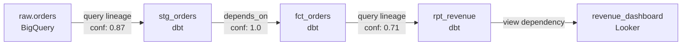
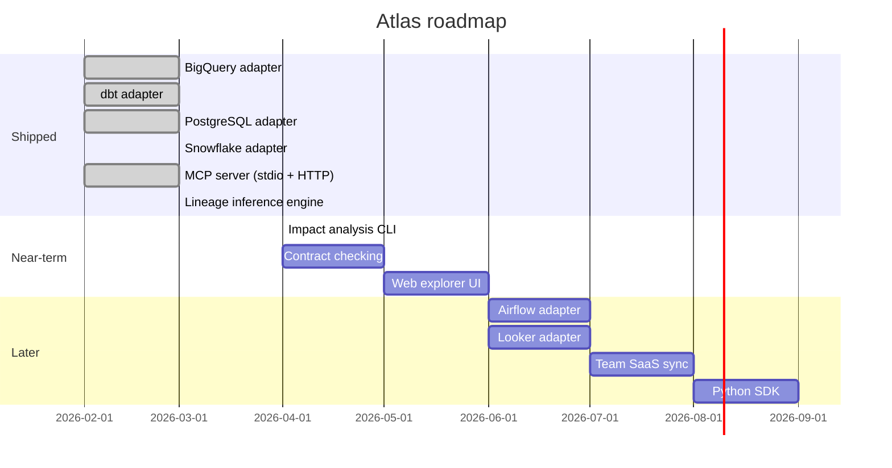

# Why AI writes bad SQL — and how to fix it with a data intelligence layer

> Historical launch draft only. This file is not the current product or runtime
> source of truth; use the main README and current docs instead.

---

## The problem

AI coding assistants have gotten very good at SQL. Given a prompt like "write a query that shows revenue by region for last quarter", Cursor or Claude will produce something that looks correct, compiles, and runs. The problem is it might reference `orders.region` when your actual column is `orders.shipping_region`. Or join on `customer_id` when the right join key in your warehouse is `cust_uuid`. Or read from `analytics.revenue` when the canonical mart is `mart.revenue_v2` and `analytics.revenue` stopped updating two months ago.

These aren't LLM hallucinations in the model quality sense — they're context gaps. The model has never seen your warehouse. It's making educated guesses based on naming conventions and the files in your repo. For generic web app CRUD, that's usually fine. For data engineering work, where the schema is the contract and lineage is the implicit dependency graph, it fails in ways that are hard to catch until something breaks in production.

The failure mode is predictable:

1. Engineer asks AI to refactor a dbt model
2. AI writes valid SQL referencing `stg_orders.created_at`
3. That column was renamed to `stg_orders.order_created_at` six months ago
4. The model compiles (dbt doesn't validate columns at compile time by default)
5. The downstream dashboard fails at 6 AM

The cost isn't the broken query — it's the 45 minutes of debugging to figure out which upstream change caused it, and the realization that the AI tool that was supposed to save time created the incident.

## What Atlas does

Atlas is a local CLI + MCP server that builds a knowledge graph of your data stack and exposes it to AI coding tools via the [Model Context Protocol](https://modelcontextprotocol.io).

The core idea: your warehouse already has this information — schemas in `INFORMATION_SCHEMA`, query history in `JOBS_BY_PROJECT` or `QUERY_HISTORY`, lineage in dbt manifests. Atlas extracts it, stitches it together across systems, stores it locally, and makes it queryable by your AI agent in real time.

```bash
pip install alma-atlas

alma-atlas connect bigquery --project my-gcp-project
alma-atlas connect dbt --project-dir ./analytics

alma-atlas scan
# ✓ Scanned 2 sources
#   BigQuery (my-project): 247 tables, 3,891 columns, 12 datasets
#   dbt (analytics): 89 models, 34 sources, 156 tests
# ✓ Built graph: 336 assets, 412 edges
# ✓ Inferred 67 lineage paths from query history

alma-atlas serve
# MCP server running on stdio
```

Now add Atlas to your IDE's MCP config and your agent can call tools like:

```
atlas_search("orders")
→ bigquery:my-project.raw.orders [TABLE]
→ bigquery:my-project.analytics.orders_daily [VIEW]
→ dbt:analytics.fct_orders [TABLE] — Fact table for order events

atlas_get_schema("dbt:analytics.fct_orders")
→ order_id        STRING    NOT NULL
→ customer_id     STRING    NOT NULL
→ order_created_at TIMESTAMP NOT NULL   ← the actual column name
→ status          STRING    NULL
→ total_amount    NUMERIC   NULL

atlas_impact("bigquery:my-project.raw.orders")
→ 5 downstream assets would be affected:
→   bigquery:my-project.analytics.orders
→   bigquery:my-project.analytics.orders_daily
→   dbt:analytics.stg_orders
→   dbt:analytics.fct_orders
→   dbt:analytics.rpt_revenue
```

Before writing any migration, your agent has the live schema, knows the correct column names, and can see the blast radius of the change. The renamed column incident from the scenario above becomes: agent calls `atlas_get_schema`, sees `order_created_at`, uses the right name.

## How it works

### Graph model

Atlas models your data stack as a directed graph with four entity types:

- **Assets** — tables, views, dbt models, seeds, snapshots. Each carries structural metadata (schema, column types, nullability), operational metadata (row counts, first/last seen), and usage data (query frequency, consumer identity).
- **Edges** — directed connections representing data flow: ETL pipelines, dbt `ref()` dependencies, view definitions, query-inferred lineage.
- **Consumers** — identified entities that query assets: Airflow DAGs (extracted from job labels), user emails, application names.
- **Query fingerprints** — normalized, deduplicated representations of observed query patterns and the tables they touch.



### Lineage inference

For warehouses that don't provide native lineage (BigQuery, Snowflake), Atlas infers it from query logs:

1. Pull job history from `INFORMATION_SCHEMA.JOBS_BY_PROJECT` (BigQuery) or `ACCOUNT_USAGE.QUERY_HISTORY` (Snowflake)
2. Parse each SQL statement with a dialect-agnostic parser
3. Extract table references: which assets does this query read from, write to
4. Build directed edges weighted by query frequency and recency
5. Score confidence based on the inference method (declared dbt ref = 1.0, query-inferred = 0.3–0.9)

The result is a lineage graph that reflects what actually ran in your warehouse, not just what was declared in code.

### Cross-system identity resolution

The hardest problem: `production.public.orders` (Postgres), `raw.orders` (Snowflake), `stg_orders` (dbt), and the "Orders" explore (Looker) may all represent the same logical data at different stages. Atlas uses three resolution strategies:

| Strategy | Confidence | How it works |
|----------|-----------|--------------|
| Declared mapping | 1.0 | dbt `source()` declarations in YAML explicitly map dbt sources to warehouse tables |
| Schema-match heuristic | 0.5–0.9 | Weighted score: name match (0.5) + column overlap (0.3) + type compatibility (0.1) + row count similarity (0.1) |
| Traffic correlation | 0.3–0.7 | If table A updates at 02:00 and table B updates at 02:15 with matching schema fingerprint, they're likely connected |

Strategies compose: a table pair might start as a schema match at 0.7, get promoted to 1.0 when a dbt source declaration confirms it.

### Metadata only

Atlas never reads data values. It operates on structural metadata (table names, column names, types), operational metadata (query logs with literals stripped, execution stats), and semantic metadata (dbt descriptions, tags, test definitions). This is an intentional design choice — schema metadata is out of scope for HIPAA (not PHI), PCI-DSS (not cardholder data), and most data protection frameworks.

## Supported adapters

| Adapter | Schema | Query Traffic | Lineage | Execute |
|---------|--------|---------------|---------|---------|
| BigQuery | Yes | INFORMATION_SCHEMA.JOBS | Yes | Yes |
| Snowflake | Yes | ACCOUNT_USAGE.QUERY_HISTORY | Yes | Yes |
| PostgreSQL | Yes | pg_stat_statements / logs | Yes | Yes |
| dbt | Yes (manifest + catalog) | No | Yes (depends_on) | No |

## What we're not claiming

Atlas is early. Some honest limitations:

- **No Airflow or Looker adapters yet.** Both are on the roadmap. For now, pipeline orchestration and BI tool context require those systems' APIs, which we haven't shipped.
- **No column-level lineage for Postgres.** Column-level tracing requires query log access, which managed Postgres (RDS, Cloud SQL) typically restricts. View dependencies work; per-column flow doesn't.
- **SQLite doesn't scale to 100k+ assets.** The local store is fast enough for single-engineer use and mid-size stacks. We haven't benchmarked it at very large scale. The graph schema is identical to Alma's production PostgreSQL backend, so this is a swap, not a redesign.
- **Inference confidence is imperfect.** Query-inferred lineage is probabilistic. Low-confidence edges (< 0.5) are stored but flagged. You should verify inferred lineage for critical pipelines.

## Roadmap



## Try it

```bash
pip install alma-atlas
alma-atlas connect bigquery --project your-project
alma-atlas scan
alma-atlas serve
```

GitHub: https://github.com/almaos/atlas
Apache 2.0.

If you're using it, we'd like to know what adapters you need next, what the lineage inference gets wrong for your stack, and what MCP tools would be most useful to add. Open an issue or start a discussion.
