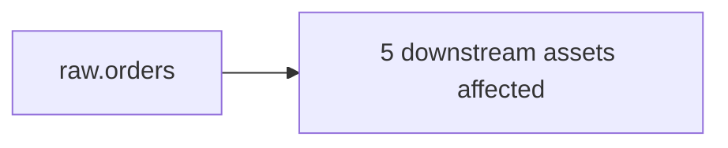

# Twitter/X Thread Draft

> Historical launch draft only. This file is not the current product or runtime
> source of truth; use the main README and current docs instead.

---

**Tweet 1 (hook)**

AI writes bad SQL because it has no idea what your warehouse actually looks like.

It guesses column names. It picks the wrong table. It misses the join key you renamed six months ago.

Introducing Alma Atlas — open-source data intelligence for AI coding tools.

[link]

---

**Tweet 2 (the problem)**

Here's the failure mode:

1. You ask Cursor to refactor a dbt model
2. It writes valid SQL referencing `stg_orders.created_at`
3. That column was renamed to `order_created_at` months ago
4. dbt compiles fine (no runtime column validation by default)
5. The dashboard fails at 6 AM

The AI wasn't wrong — it was uninformed.

---

**Tweet 3 (the fix)**

Atlas gives your AI agent the context it's missing:

- Live schemas from your warehouse
- Lineage: what feeds each table, what depends on it
- Query traffic: which columns are actually used
- Blast radius: what breaks before you make a change

All local. No signup. No SaaS.

---

**Tweet 4 (demo)**

```bash
pip install alma-atlas
alma-atlas connect bigquery --project my-project
alma-atlas connect dbt --project-dir ./analytics
alma-atlas scan
alma-atlas serve
```

Now your AI can call:

**`atlas_get_schema("dbt:analytics.fct_orders")`** — returns columns such as `order_id`, `customer_id`, `order_created_at`, `status`, `total_amount`.

**`atlas_impact("raw.orders")`** — five downstream assets would be affected:



---

**Tweet 5 (how it works)**

Atlas builds a knowledge graph from what your warehouse already exposes:

- Schemas from INFORMATION_SCHEMA
- Lineage inferred from query logs (BigQuery JOBS, Snowflake QUERY_HISTORY)
- dbt dependency graph from manifest.json
- Cross-system identity stitched by schema matching + declared mappings

Stored locally in SQLite. Served over MCP stdio.

---

**Tweet 6 (adapters + MCP tools)**

Supported today:
- BigQuery, Snowflake, PostgreSQL, dbt

MCP tools:
- atlas_search — find any asset
- atlas_get_schema — live column types
- atlas_lineage — upstream/downstream traversal
- atlas_impact — blast radius analysis
- atlas_get_asset, atlas_status

Apache 2.0. Python 3.12+.

---

**Tweet 7 (honest about limitations)**

What it doesn't do yet:

- No Airflow or Looker adapters
- No column-level lineage for Postgres (managed DB log restrictions)
- SQLite store hasn't been tested at 100k+ assets

Early. Functional. Useful if you're tired of AI guessing your schema.

---

**Tweet 8 (CTA)**

GitHub: https://github.com/almaos/atlas

```bash
pip install alma-atlas
```

Issues, adapter requests, and "this is completely wrong for my stack" welcome.

What data source would make this useful for you?
